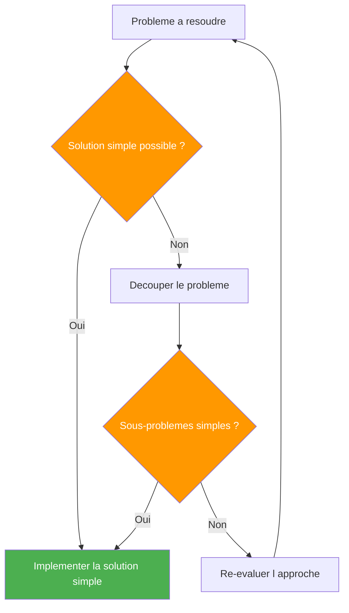
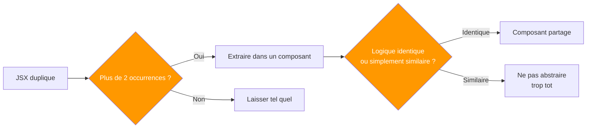
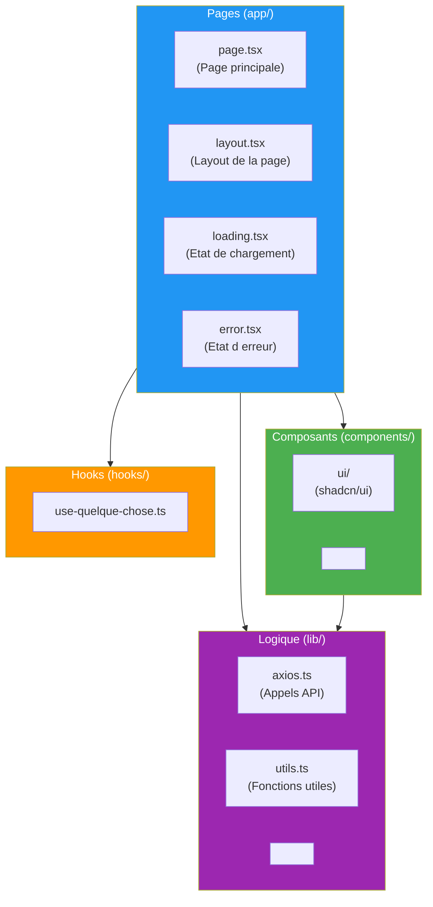
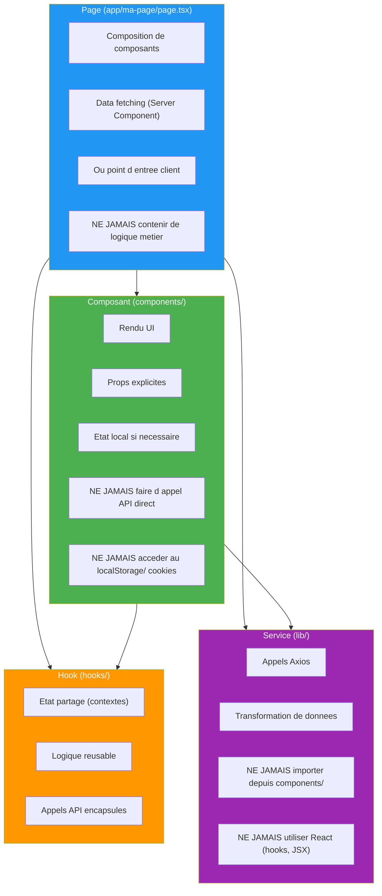
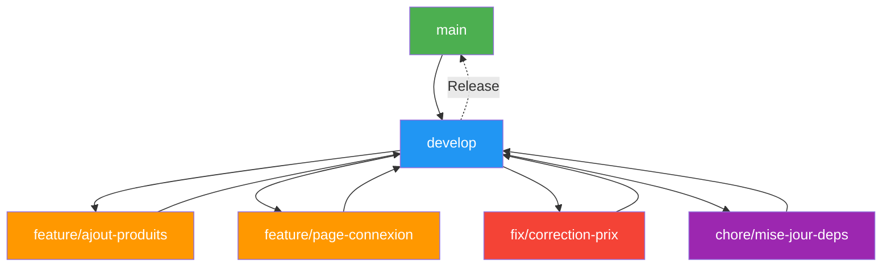
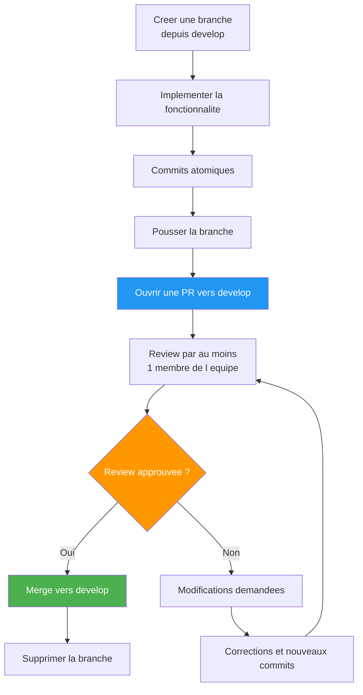
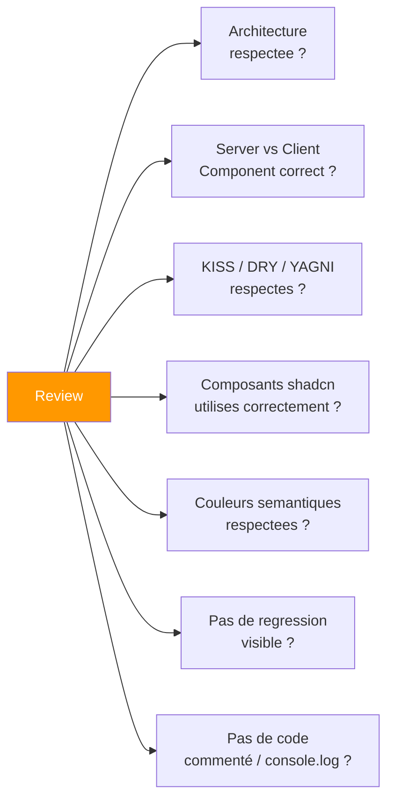
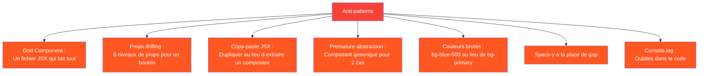

# Guide de contribution — OmniaCom Frontend

Ce document definit les standards de code, les regles d'architecture, les conventions de nommage, et le workflow Git a respecter sur ce projet. Toute contribution doit s'y conformer.

---

## Table des matieres

1. [Principes fondamentaux](#1-principes-fondamentaux)
2. [Architecture du projet](#2-architecture-du-projet)
3. [Conventions de nommage](#3-conventions-de-nommage)
4. [Regles d ecriture du code](#4-regles-d-ecriture-du-code)
5. [Composants](#5-composants)
6. [Formulaires](#6-formulaires)
7. [Appels API](#7-appels-api)
8. [Workflow Git](#8-workflow-git)
9. [Conventions de commits](#9-conventions-de-commits)
10. [Pull Requests](#10-pull-requests)
11. [Code Review](#11-code-review)
12. [Cas pratiques](#12-cas-pratiques)

---

## 1. Principes fondamentaux

### 1.1 KISS (Keep It Simple, Stupid)

La simplicite est la priorite absolue. Une solution simple est plus facile a comprendre, tester, deboguer et maintenir.



**Regles KISS :**
- N ajoutez jamais une abstraction « au cas ou ». Attendez d avoir 3 repetitions avant d abstraire.
- Un composant = une responsabilite. Si un fichier JSX fait deux choses differentes, decoupez-le.
- Un composant ne doit pas depasser 200 lignes. Au-dela, extrayez des sous-composants.
- Un fichier de logique (`lib/`, `hooks/`) ne doit pas depasser 300 lignes. Au-dela, decoupez-le.
- Evitez les design patterns inutiles. Un simple `if` dans le JSX vaut mieux qu un composant « HOC factory » pour 2 cas.

### 1.2 DRY (Don t Repeat Yourself)

Ne dupliquez pas la logique. Mutualisez ce qui est identique, mais ne forcez pas la mutualisation de ce qui est simplement similaire.



**Piege du DRY-force :** Deux parties d UI qui se ressemblent a 70% ne doivent pas forcement etre fusionnees avec 6 props et 4 conditions. Parfois la duplication JSX est moins chere que la complexite d un composant sur-parametre.

### 1.3 YAGNI (You Ain t Gonna Need It)

N implementez jamais une fonctionnalite « au cas ou ». Implementez uniquement ce qui est necessaire maintenant.

### 1.4 Separation des responsabilites

Chaque couche a un role unique et ne doit pas empieter sur une autre.

---

## 2. Architecture du projet

### 2.1 Vue d ensemble



### 2.2 Responsabilites de chaque couche



### 2.3 Regles strictes par couche

#### Pages (`app/**/page.tsx`)

- Chaque dossier dans `app/` represente une route.
- Une page peut etre **Server Component** (par defaut) ou **Client Component** (`"use client"`).
- Les pages serveur font le data fetching directement (`async function Page()`).
- Les pages client utilisent des hooks (`useEffect`, `useAuth`, etc.).
- Un dossier de page peut contenir : `page.tsx`, `layout.tsx`, `loading.tsx`, `error.tsx`.

```tsx
// BON - Server Component : data fetching direct
export default async function ProduitsPage() {
  const produits = await api.get("/produits");
  return <ProduitsList produits={produits.data} />;
}

// BON - Client Component : hook + etat local
("use client");
export default function LoginPage() {
  const [email, setEmail] = useState("");
  // ...
}
```

#### Composants (`components/`)

- Un composant = un fichier.
- Nommez le fichier comme le composant : `MonComposant.tsx` → `export function MonComposant()`.
- Les composants UI (shadcn) sont dans `components/ui/` — ne pas modifier.
- Les composants metier sont dans `components/` directement ou dans des sous-dossiers.
- Un composant ne doit pas depasser 200 lignes. Si c est le cas, extrayez des sous-composants.
- Les props sont definies avec TypeScript, pas avec `PropTypes`.

```tsx
// BON
interface ProduitCardProps {
  nom: string;
  prix: number;
  stock: number;
}

export function ProduitCard({ nom, prix, stock }: ProduitCardProps) {
  return (
    <Card>
      <CardHeader>
        <CardTitle>{nom}</CardTitle>
      </CardHeader>
      <CardContent>
        <p>{prix} €</p>
        <Badge variant={stock > 0 ? "default" : "destructive"}>
          {stock > 0 ? "En stock" : "Rupture"}
        </Badge>
      </CardContent>
    </Card>
  );
}
```

#### Hooks (`hooks/`)

- Un hook = une responsabilite.
- Les hooks personnalises encapsulent la logique d etat ou les effets de bord.
- Les hooks peuvent appeler des services (`lib/`) mais pas l inverse.

```tsx
// BON
export function useProduits() {
  const [produits, setProduits] = useState<Produit[]>([]);
  const [isLoading, setIsLoading] = useState(true);

  useEffect(() => {
    api.get("/produits").then((res) => {
      setProduits(res.data);
      setIsLoading(false);
    });
  }, []);

  return { produits, isLoading };
}
```

#### Services / Logique (`lib/`)

- Contient la logique non-React : appels API, transformations, constantes, fonctions pures.
- NE DOIT PAS importer depuis `components/` ou `hooks/`.
- NE DOIT PAS utiliser de hooks React.
- Un fichier par domaine : `produits.service.ts`, `auth.service.ts`, `formatage.ts`.

```tsx
// BON - lib/produits.service.ts
import { api } from "./axios";
import type { Produit } from "@/types/produit";

export async function getProduits(): Promise<Produit[]> {
  const { data } = await api.get("/produits");
  return data;
}

export async function getProduitById(id: number): Promise<Produit> {
  const { data } = await api.get(`/produits/${id}`);
  return data;
}
```

---

## 3. Conventions de nommage

### 3.1 Regles generales

| Element | Convention | Exemple |
|---|---|---|
| Variables | `camelCase` | `const nomUtilisateur = "Jean"` |
| Fonctions | `camelCase`, verbes | `function getUtilisateur()` |
| Composants | `PascalCase` | `function ProduitCard()` |
| Fichiers composants | `PascalCase.tsx` | `ProduitCard.tsx` |
| Fichiers hooks | `kebab-case.ts` | `use-produits.ts` |
| Fichiers services | `kebab-case.ts` | `produits.service.ts` |
| Fichiers pages | `page.tsx` | (convention Next.js) |
| Fichiers layout | `layout.tsx` | (convention Next.js) |
| Dossiers | `kebab-case` | `auth/`, `liste-produits/` |
| Dossiers de routes | `kebab-case` | `app/mon-compte/` |
| Routes dynamiques | `[param]` | `app/produits/[id]/` |
| Constantes | `UPPER_SNAKE_CASE` | `const MAX_ITEMS = 50` |
| Variables d env | `NEXT_PUBLIC_*` | `NEXT_PUBLIC_API_URL` |
| Exports nommes | `camelCase` / `PascalCase` | `export function MonComposant()` |
| Export default | `PascalCase` | `export default function Page()` |
| Types / Interfaces | `PascalCase` | `interface ProduitProps` |

### 3.2 Noms de fonctions

Toujours commencer par un verbe :

```tsx
// BON
function getUtilisateur(id: string)
function createProduit(data: ProduitData)
function formatPrix(montant: number)
function isEmailValide(email: string)
function handleSubmit(e: React.FormEvent)
function onDelete(id: string)

// MAUVAIS
function utilisateur(id: string)
function produit(data: ProduitData)
function check(email: string)
```

### 3.3 Noms de variables

- Utilisez des noms explicites. Pas d abreviation.
- Pas de `data`, `info`, `tmp`, `result` tout seul.

```tsx
// BON
const utilisateurExistant = utilisateurs.find((u) => u.id === id);
const produitsEnStock = produits.filter((p) => p.stock > 0);

// MAUVAIS
const d = utilisateurs.find((u) => u.id === id);
const data = produits.filter((p) => p.stock > 0);
```

### 3.4 Noms de fichiers

```text
components/
  ui/
    button.tsx          # Composant shadcn
    card.tsx
  ProduitCard.tsx       # Composant metier
  ListeProduits.tsx

hooks/
  use-produits.ts       # Hook
  use-auth.ts

lib/
  produits.service.ts   # Service
  axios.ts              # Configuration Axios
  utils.ts              # Fonctions utiles

app/
  page.tsx              # Page d accueil
  produits/
    page.tsx            # Liste des produits
    [id]/
      page.tsx          # Detail d un produit
  connexion/
    page.tsx            # Page de connexion
```

---

## 4. Regles d ecriture du code

### 4.1 Structure d un fichier

Chaque fichier suit un ordre precis :

```tsx
// 1. Directives (si necessaire)
"use client";

// 2. Imports (groupes separes par un saut de ligne)
import { useState } from "react";
import { SearchIcon } from "lucide-react";

import { Button } from "@/components/ui/button";
import { Input } from "@/components/ui/input";
import { api } from "@/lib/axios";

// 3. Types et interfaces
interface RechercheProps {
  onSearch: (query: string) => void;
}

// 4. Constantes (si necessaire)
const DEBOUNCE_DELAY = 300;

// 5. Composant / fonction principale
export function BarreRecherche({ onSearch }: RechercheProps) {
  // ...
}

// 6. Sous-composants ou fonctions privees
function useDebounce(value: string, delay: number) {
  // ...
}
```

### 4.2 Composants : Server vs Client

```tsx
// Serveur Component (par defaut) : pas de "use client"
// Peut etre async, utilise les props, pas de hooks
export default async function ProduitsPage() {
  const produits = await getProduits();
  return <ProduitsList produits={produits} />;
}

// Client Component : "use client" en premiere ligne
// Peut utiliser useState, useEffect, event handlers
"use client";
export function BarreRecherche() {
  const [query, setQuery] = useState("");
  // ...
}
```

**Regle :** Mettez `"use client"` le plus bas possible dans l arbre. Un composant serveur parent peut contenir des enfants clients.

### 4.3 Props

- Utilisez `interface` (pas `type`) pour les props des composants.
- Prefixez le nom par le nom du composant : `ProduitCardProps`.
- Destructurez les props dans l entete du composant.

```tsx
// BON
interface ProduitCardProps {
  nom: string;
  prix: number;
  stock: number;
  className?: string;
}

export function ProduitCard({ nom, prix, stock, className }: ProduitCardProps) {
  return <div className={cn("p-4", className)}>...</div>;
}

// MAUVAIS
export function ProduitCard(props: { nom: string; prix: number }) {
  return <div>{props.nom} - {props.prix} €</div>;
}
```

### 4.4 Early return et guard clauses

Preferez les guard clauses aux ternaires ou `&&` imbriques dans le JSX :

```tsx
// BON - Guard clause
export function PageProduit({ id }: { id: string }) {
  const { produit, isLoading, error } = useProduit(id);

  if (isLoading) return <Spinner />;
  if (error) return <Alert variant="destructive">{error}</Alert>;
  if (!produit) return <Empty description="Produit introuvable" />;

  return <ProduitDetail produit={produit} />;
}

// MAUVAIS - Ternaire imbrique
export function PageProduit({ id }: { id: string }) {
  const { produit, isLoading, error } = useProduit(id);

  return (
    <div>
      {isLoading ? (
        <Spinner />
      ) : error ? (
        <Alert variant="destructive">{error}</Alert>
      ) : produit ? (
        <ProduitDetail produit={produit} />
      ) : (
        <Empty description="Produit introuvable" />
      )}
    </div>
  );
}
```

### 4.5 Pas de `console.log` dans le code

- Utilisez `console.log` uniquement pour le debug temporaire.
- Ne commitez jamais de `console.log`.
- Utilisez les toasts (`sonner`) pour les notifications utilisateur.

### 4.6 Imports

- Utilisez l alias `@/` (configure dans tsconfig.json) pour les imports internes.
- Groupez les imports : packages externes d abord, internes ensuite.

```tsx
// BON
import { useState } from "react";
import { toast } from "sonner";
import { SearchIcon } from "lucide-react";

import { Button } from "@/components/ui/button";
import { api } from "@/lib/axios";
import { cn } from "@/lib/utils";

// MAUVAIS
import Button from "../../../components/ui/button";  // Chemin relatif trop long
import { api, cn, utils } from "@/lib/index";         // Barrel file inutile
```

### 4.7 Limites de complexite

| Metrique | Limite | Action |
|---|---|---|
| Lignes par fichier JSX | 200 max | Decouper en sous-composants |
| Lignes par fichier TS | 300 max | Decouper en plusieurs fichiers |
| Lignes par fonction | 40 max | Extraire des sous-fonctions |
| Parametres par fonction | 3 max | Grouper dans un objet |
| Props par composant | 6 max | Decouper le composant |
| Niveaux d imbrication JSX | 4 max | Extraire des sous-composants |
| Imbrication `if` | 2 max | Early return ou guard clause |

---

## 5. Composants

### 5.1 Composants shadcn/ui

Tous les composants shadcn/ui sont dans `components/ui/`. Ils sont installes et prets a l emploi.

**Importation :**
```tsx
import { Button } from "@/components/ui/button";
import { Card, CardHeader, CardTitle, CardContent } from "@/components/ui/card";
import { Input } from "@/components/ui/input";
import { Spinner } from "@/components/ui/spinner";
import { Badge } from "@/components/ui/badge";
```

**Ne jamais modifier les fichiers dans `components/ui/`.** Si un composant necessite une adaptation, faites un composant wrapper metier.

### 5.2 Composition des composants

Utilisez la composition plutot que la configuration :

```tsx
// BON - Composition
<Card>
  <CardHeader>
    <CardTitle>Titre</CardTitle>
  </CardHeader>
  <CardContent>
    <p>Contenu</p>
  </CardContent>
  <CardFooter>
    <Button>Action</Button>
  </CardFooter>
</Card>

// MAUVAIS - Prop de configuration
<MaCarte titre="Titre" contenu="Contenu" footer={<Button>Action</Button>} />
```

### 5.3 Couleurs semantiques

Utilisez les couleurs semantiques, jamais de valeurs brutes :

```tsx
// BON
<div className="bg-primary text-primary-foreground" />
<Badge variant="destructive" />
<p className="text-muted-foreground" />

// MAUVAIS
<div className="bg-blue-500 text-white" />
<span className="text-red-600" />
```

Couleurs disponibles : `background`, `foreground`, `card`, `popover`, `primary`, `secondary`, `muted`, `accent`, `destructive`, `border`, `input`, `ring`.

### 5.4 Espacement

Utilisez `gap-*` plutot que `space-x-*` ou `space-y-*` :

```tsx
// BON
<div className="flex flex-col gap-4">
  <p>Element 1</p>
  <p>Element 2</p>
</div>

// A EVITER
<div className="space-y-4">
  <p>Element 1</p>
  <p>Element 2</p>
</div>
```

### 5.5 Taille

Quand largeur et hauteur sont egales, utilisez `size-*` :

```tsx
// BON
<Avatar className="size-10" />

// A EVITER
<Avatar className="w-10 h-10" />
```

### 5.6 Icones dans les boutons

```tsx
import { SearchIcon } from "lucide-react";

// BON
<Button>
  <SearchIcon data-icon="inline-start" />
  Rechercher
</Button>

// A EVITER - Sans data-icon, avec classe de taille
<Button>
  <SearchIcon className="size-4" />
  Rechercher
</Button>
```

### 5.7 Accessibilite

- Les dialogues (`Dialog`, `Sheet`, `Drawer`) necessitent toujours un titre (`DialogTitle`, etc.).
- `Avatar` necessite toujours un `AvatarFallback`.
- Les champs de formulaire invalides doivent avoir `aria-invalid` sur le controle et `data-invalid` sur le `Field`.

---

## 6. Formulaires

### 6.1 Structure d un formulaire

Utilisez les composants `Field` et `InputGroup` pour les formulaires :

```tsx
import { Field, FieldLabel, FieldGroup, FieldError } from "@/components/ui/field";
import { InputGroup, InputGroupInput, InputGroupAddon } from "@/components/ui/input-group";
import { MailIcon } from "lucide-react";

<FieldGroup>
  <Field data-invalid={!!error}>
    <FieldLabel htmlFor="email">Email</FieldLabel>
    <InputGroup>
      <InputGroupAddon align="inline-start">
        <MailIcon />
      </InputGroupAddon>
      <InputGroupInput
        id="email"
        type="email"
        value={email}
        onChange={(e) => setEmail(e.target.value)}
        aria-invalid={!!error}
      />
    </InputGroup>
    <FieldError>{error}</FieldError>
  </Field>
</FieldGroup>
```

### 6.2 Validation cote client

```tsx
function validateEmail(email: string): string | null {
  if (!email) return "L email est requis";
  if (!email.includes("@")) return "Email invalide";
  return null;
}

function handleSubmit(e: React.FormEvent) {
  e.preventDefault();

  const error = validateEmail(email);
  if (error) {
    setError(error);
    return;
  }

  // Appel API
}
```

### 6.3 Etat de soumission

```tsx
const [isLoading, setIsLoading] = useState(false);

<Button type="submit" disabled={isLoading}>
  {isLoading ? (
    <>
      <Spinner data-icon="inline-start" />
      En cours...
    </>
  ) : (
    "Envoyer"
  )}
</Button>
```

---

## 7. Appels API

### 7.1 Instance Axios

L instance Axios est preconfiguree dans `lib/axios.ts` :

```tsx
import { api } from "@/lib/axios";

// GET
const { data } = await api.get("/produits");

// POST
const { data } = await api.post("/produits", { nom: "Chaise", prix: 49.99 });

// PUT
const { data } = await api.put("/produits/1", { prix: 39.99 });

// DELETE
await api.delete("/produits/1");
```

### 7.2 Appels dans un service

Encapsulez les appels API dans des services :

```tsx
// lib/produits.service.ts
import { api } from "./axios";

export interface Produit {
  id: number;
  nom: string;
  prix: number;
  stock: number;
}

export async function getProduits(): Promise<Produit[]> {
  const { data } = await api.get("/produits");
  return data;
}

export async function getProduitById(id: number): Promise<Produit> {
  const { data } = await api.get(`/produits/${id}`);
  return data;
}
```

### 7.3 Gestion des erreurs API

```tsx
try {
  const produits = await getProduits();
  setProduits(produits);
} catch (err) {
  if (err instanceof AxiosError) {
    toast.error(err.response?.data?.message || "Erreur lors du chargement");
  } else {
    toast.error("Une erreur inattendue est survenue");
  }
}
```

---

## 8. Workflow Git

### 8.1 Branches



### 8.2 Regles de branches

1. **`main`** — Branche de production. Protegee. Pas de push direct.
2. **`develop`** — Branche d integration. Base pour toutes les branches de fonctionnalites.
3. **`feature/*`** — Nouvelle fonctionnalite. Basee sur `develop`. Fusionnee vers `develop`.
4. **`fix/*`** — Correction de bug. Basee sur `develop`. Fusionnee vers `develop`.
5. **`hotfix/*`** — Correctif urgent. Basee sur `main`. Fusionnee vers `main` ET `develop`.
6. **`chore/*`** — Maintenance (deps, config, CI). Basee sur `develop`.

### 8.3 Convention de nommage des branches

```
feature/{description-courte}
fix/{description-courte}
hotfix/{description-courte}
chore/{description-courte}
```

Exemples :
```
feature/ajout-page-produits
fix/correction-affichage-prix
hotfix/regression-page-accueil
chore/mise-a-jour-tailwind
```

### 8.4 Interdiction de push direct sur main et develop

- Aucun push direct autorise sur `main` et `develop`.
- Toute modification passe par une Pull Review.
- La PR doit etre approuvee par au moins un reviewer.
- Les PR doivent passer les verifications automatiques (CI).

---

## 9. Conventions de commits

### 9.1 Format du message de commit

```
type(scope): message court

Corps optionnel si necessaire
```

### 9.2 Types autorises

| Type | Usage | Exemple |
|---|---|---|
| `feat` | Nouvelle fonctionnalite | `feat(produits): ajoute la page liste des produits` |
| `fix` | Correction de bug | `fix(panier): corrige le calcul du total` |
| `refactor` | Refactorisation sans changement fonctionnel | `refactor(auth): extrait le contexte dans un hook` |
| `chore` | Maintenance, dependances, config | `chore(deps): met a jour tailwindcss` |
| `docs` | Documentation uniquement | `docs(readme): ajoute la section composants` |
| `style` | Formatage, CSS, Tailwind | `style(card): ajuste les espacements` |
| `test` | Ajout ou modification de tests | `test(produits): ajoute les tests du service` |

### 9.3 Regles

- **Commits atomiques** : un commit = un changement logique.
- Le message court (subject) ne depasse pas **50 caracteres**.
- Le subject commence par une **minuscule**.
- Pas de point a la fin du subject.
- Le corps (body) est optionnel. Utilisez-le si le commit necessite une explication.
- Le corps est wrappe a **72 caracteres** par ligne.

```text
# BON
feat(produits): ajoute la page de detail produit

fix(panier): corrige le calcul du total avec la TVA

refactor(auth): deplace la logique de connexion dans un hook

docs(readme): ajoute la section bonnes pratiques

chore(deps): met a jour next vers 16.2

# MAUVAIS
fix bug                                      # Pas de type ni scope
feat(produits): Ajoute la page              # Majuscule au debut
feat(produits): ajoute la page de detail produit avec les infos et le bouton d achat  # Trop long
added stuff                                  # Pas explicite
```

---

## 10. Pull Requests

### 10.1 Processus



### 10.2 Template de Pull Request

```markdown
## Description

Resume clair et concis de la modification.

## Type de changement

- [ ] Nouvelle fonctionnalite (feat)
- [ ] Correction de bug (fix)
- [ ] Refactorisation (refactor)
- [ ] Documentation (docs)
- [ ] Maintenance / dependances (chore)

## Comment cela a ete teste ?

- [ ] Teste manuellement avec `npm run dev`
- [ ] Responsive : la page s affiche correctement sur mobile
- [ ] Pas de console.log residuel
- [ ] Le build passe (`npm run build`)

## Checklist

- [ ] Mon code suit les conventions de nommage du projet
- [ ] J ai utilise les composants shadcn/ui existants
- [ ] J ai utilise les couleurs semantiques (pas de classes `bg-blue-500` manuelles)
- [ ] J ai respecte la separation Server / Client Component
- [ ] Mes commits sont atomiques et suivent le format conventionnel
- [ ] Je n ai pas pousse de fichiers inutiles (node_modules, .env, .next)

## Issues fermees

Fixes #123
```

### 10.3 Regles

- Une PR = un changement logique. Pas de PR geantes de 30 fichiers.
- Une PR ne doit pas depasser 400 lignes de diff (hors fichiers generes ou shadcn).
- Le titre de la PR suit le format du commit : `type(scope): description`.
- Ne mergez jamais votre propre PR sans reviewer.
- Supprimez la branche apres merge.
- Verifiez que `npm run build` passe avant de soumettre la PR.

---

## 11. Code Review

### 11.1 Ce que le reviewer verifie



### 11.2 Comment reviewer

- **Inspirez-vous, ne dictez pas** : si le code fonctionne et respecte les standards, il peut etre merge meme si vous auriez ecrit differemment.
- **Soyez precis** : au lieu de « ce code est moche », dites « ce composant pourrait etre simplifie avec un early return ligne 12 ».
- **Distinguer l essentiel du secondaire** : une regle de style mineure ne bloque pas le merge. Un defaut d architecture oui.
- **Utilisez le systeme de suggestions** pour proposer des modifications precises.

### 11.3 Checklist du reviewer

```markdown
- [ ] L architecture Page/Composant/Hook/Service est respectee
- [ ] Le bon type de composant est utilise (Server vs Client)
- [ ] Les composants shadcn sont utilises correctement
- [ ] Les couleurs semantiques sont utilisees (pas de valeurs brutes)
- [ ] Les espacements utilisent `gap-*` (pas `space-*`)
- [ ] Les icones ont `data-icon` dans les boutons
- [ ] Pas de console.log, pas de code commente
- [ ] Les imports utilisent l alias `@/`
- [ ] Les props sont definies avec TypeScript
- [ ] La PR respecte le template
- [ ] Les commits sont atomiques et bien formates
```

---

## 12. Cas pratiques

### 12.1 Creer une nouvelle page (ex: page produits)

```bash
# 1. Creer le dossier
mkdir -p app/produits

# 2. Creer la page
touch app/produits/page.tsx
```

```tsx
// app/produits/page.tsx
import { getProduits } from "@/lib/produits.service";
import { ProduitCard } from "@/components/ProduitCard";

export default async function ProduitsPage() {
  const produits = await getProduits();

  return (
    <div className="flex flex-col gap-6 p-6">
      <h1 className="text-2xl font-bold">Nos produits</h1>
      <div className="grid grid-cols-1 gap-4 sm:grid-cols-2 lg:grid-cols-3">
        {produits.map((produit) => (
          <ProduitCard key={produit.id} {...produit} />
        ))}
      </div>
    </div>
  );
}
```

```bash
# 3. Commit
git checkout -b feature/ajout-page-produits
git add .
git commit -m "feat(produits): ajoute la page liste des produits"
git push origin feature/ajout-page-produits
# Ouvrir PR vers develop
```

### 12.2 Creer un formulaire de connexion

```tsx
"use client";

import { useState } from "react";
import { toast } from "sonner";
import { MailIcon, LockIcon } from "lucide-react";

import { Button } from "@/components/ui/button";
import { Card, CardHeader, CardTitle, CardDescription, CardContent, CardFooter } from "@/components/ui/card";
import { Field, FieldLabel, FieldGroup, FieldError } from "@/components/ui/field";
import { InputGroup, InputGroupInput, InputGroupAddon } from "@/components/ui/input-group";
import { Spinner } from "@/components/ui/spinner";
import { api } from "@/lib/axios";

export default function LoginPage() {
  const [email, setEmail] = useState("");
  const [password, setPassword] = useState("");
  const [isLoading, setIsLoading] = useState(false);
  const [error, setError] = useState<string | null>(null);

  async function handleSubmit(e: React.FormEvent) {
    e.preventDefault();
    setError(null);

    if (!email || !password) {
      setError("Veuillez remplir tous les champs.");
      return;
    }

    setIsLoading(true);

    try {
      await api.post("/auth/login", { email, password });
      toast.success("Connexion reussie !");
    } catch (err) {
      const message = "Email ou mot de passe incorrect.";
      setError(message);
      toast.error(message);
    } finally {
      setIsLoading(false);
    }
  }

  return (
    <div className="flex min-h-screen items-center justify-center p-4">
      <Card className="w-full max-w-sm">
        <CardHeader>
          <CardTitle>Connexion</CardTitle>
          <CardDescription>Connectez-vous a votre compte.</CardDescription>
        </CardHeader>
        <form onSubmit={handleSubmit}>
          <CardContent>
            <FieldGroup>
              <Field data-invalid={!!error}>
                <FieldLabel htmlFor="email">Email</FieldLabel>
                <InputGroup>
                  <InputGroupAddon align="inline-start">
                    <MailIcon />
                  </InputGroupAddon>
                  <InputGroupInput id="email" type="email" value={email}
                    onChange={(e) => setEmail(e.target.value)}
                    aria-invalid={!!error} />
                </InputGroup>
              </Field>
              <Field data-invalid={!!error}>
                <FieldLabel htmlFor="password">Mot de passe</FieldLabel>
                <InputGroup>
                  <InputGroupAddon align="inline-start">
                    <LockIcon />
                  </InputGroupAddon>
                  <InputGroupInput id="password" type="password" value={password}
                    onChange={(e) => setPassword(e.target.value)}
                    aria-invalid={!!error} />
                </InputGroup>
                <FieldError>{error}</FieldError>
              </Field>
            </FieldGroup>
          </CardContent>
          <CardFooter>
            <Button type="submit" className="w-full" disabled={isLoading}>
              {isLoading ? (
                <><Spinner data-icon="inline-start" /> Connexion...</>
              ) : "Se connecter"}
            </Button>
          </CardFooter>
        </form>
      </Card>
    </div>
  );
}
```

### 12.3 Creer un hook personnalise

```tsx
// hooks/use-produits.ts
import { useState, useEffect } from "react";
import { getProduits } from "@/lib/produits.service";
import type { Produit } from "@/lib/produits.service";

export function useProduits() {
  const [produits, setProduits] = useState<Produit[]>([]);
  const [isLoading, setIsLoading] = useState(true);
  const [error, setError] = useState<string | null>(null);

  useEffect(() => {
    getProduits()
      .then(setProduits)
      .catch((err) => setError(err.message))
      .finally(() => setIsLoading(false));
  }, []);

  return { produits, isLoading, error };
}
```

### 12.4 Ajouter une route API Next.js

```bash
mkdir -p app/api/produits
touch app/api/produits/route.ts
```

```tsx
// app/api/produits/route.ts
import { NextResponse } from "next/server";

export async function GET() {
  // Proxy vers le backend
  const response = await fetch(`${process.env.NEXT_PUBLIC_API_URL}/produits`);
  const data = await response.json();
  return NextResponse.json(data);
}

export async function POST(request: Request) {
  const body = await request.json();
  const response = await fetch(`${process.env.NEXT_PUBLIC_API_URL}/produits`, {
    method: "POST",
    headers: { "Content-Type": "application/json" },
    body: JSON.stringify(body),
  });
  const data = await response.json();
  return NextResponse.json(data, { status: response.status });
}
```

---

## Annexe : Rappels et anti-patterns

### Anti-patterns a eviter absolument



### Rappels quotidiens

1. **Est-ce que quelqu un d autre comprendra ce JSX dans 6 mois ?** Si non, simplifiez ou commentez.
2. **Est-ce que cette abstraction est vraiment necessaire maintenant ?** Si non, ne la faites pas (YAGNI).
3. **Est-ce que j ai deja ecrit ce JSX ailleurs ?** Si oui, mutualisez (DRY).
4. **Est-ce que mon composant fait une seule chose ?** Si non, decoupez (KISS).
5. **Est-ce que ma page devrait etre un Server ou Client Component ?** Si elle n a pas d interactivite, serveur.
6. **Est-ce que mon message de commit est clair ?** Si non, rewordez.
7. **Est-ce que ma branche est a jour avec develop ?** Si oui, rebasez avant la PR.
8. **Est-ce que j ai verifie que je ne pousse pas de fichiers sensibles ?** .env, node_modules, .next.
